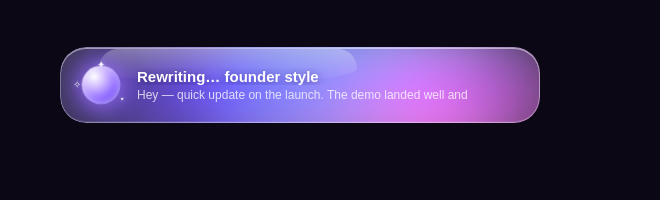

<div align="center">


# revoice

**Select text. Hit a hotkey. It's rewritten in your voice — right where you typed it.**

[](LICENSE)


[](CONTRIBUTING.md)



</div>

You're already paying for AI (ChatGPT, Claude, Kimi, or you run a free local model). So why pay for *another* subscription just to clean up your messages? revoice turns the AI you already have into a system-wide rewrite button on your Mac.

It works anywhere you can select text — Slack, Mail, Notion, your browser, your editor. No app switching, no copy-paste dance, no new subscription.

## The magic

1. Select any text, in any app.
2. Press **⌃⇧Z** (Ctrl+Shift+Z).
3. Watch the rewrite stream into a shiny liquid-glass popup.
4. Press **⏎** to swap it in — or **esc** to keep your original. Nothing is pasted until you say so.

That's it. Your clipboard is untouched, your cursor stays where it was, and the popup tells you which AI did the work.

**Before** (what you typed):

> hey just wanted to check in and see if u had a chance to look at the thing i sent over, no rush but lmk when u can

**After** (one keystroke later):

> Hey, have you had a look at that document I sent? Let me know when you get to it.

## Pick your vibe

| Hotkey | What you get |
|--------|--------------|
| **⌃⇧Z** | Your voice (tone auto-matched to the app — Slack gets casual, Mail gets professional) |
| **⌃⇧1** | Founder — direct, decisive |
| **⌃⇧2** | Casual — relaxed, friendly |
| **⌃⇧3** | Professional — polished business |
| **⌃⇧4** | Concise — about half the words |
| **⌃⇧E** | Tell it what to do ("make it shorter", "make it warmer", anything) |
| **⌃⇧R** | **Reply mode** — it looks at the thread on your screen, asks what you want to say, and drafts the reply in your voice |

Don't like the rewrite? Press **R** to regenerate or **1–4** to instantly re-run it in another style, right from the preview.

## Reply to anything in one keystroke

Staring at a Slack thread or an email you need to answer? Click into the reply box and hit **⌃⇧R**. revoice screenshots the window, asks *"What do you want to say?"* (a few rough words — or nothing, and it'll infer), and drafts the reply in your voice from what it sees on screen. Same preview: ⏎ pastes it, esc throws it away.

Best with the Codex/GPT-6 Astra backend, which reads the screenshot natively. The screenshot sits in `~/.revoice/tmp` only while the draft is in flight and is cleaned up afterwards, and nothing is captured unless you press the hotkey. macOS will ask you to allow **Screen Recording** for Hammerspoon the first time.

## It actually sounds like *you*

This is the part that makes revoice different:

- **You own the prompt.** The entire rewrite prompt is a plain text file (`~/.revoice/prompt.txt`). Edit it like a doc. Make it yours.
- **Feed it your writing.** Paste a few of your real messages into `~/.revoice/voice-samples.txt` and every rewrite imitates *your* style — not generic AI-speak.
- **No AI slop.** Two anti-slop rule packs ship by default (goodbye "I hope this finds you well" and "game-changing"). Drop in your own rules as simple markdown files.
- **It learns.** Reject a rewrite and it's remembered as a "don't write like this" example next time.

## Get started (2 minutes)

```bash
git clone https://github.com/jdanjohnson/Revoice-AI-Rewriting-Tool-.git revoice
cd revoice
./install.sh
```

Then open Hammerspoon, grant it **Accessibility** permission (System Settings → Privacy & Security → Accessibility), and click **Reload Config**.

**Hook up an AI** (any one of these):

- **ChatGPT (GPT-6 Astra)** — already have Codex? You're done. (If not: `npm i -g @openai/codex`, run `codex` once to sign in with your ChatGPT account.) Want Astra to go first? Put `REWRITE_BACKEND=codex,claude,kimi,ollama` in `~/.revoice/env`.
- **Claude** — already have Claude Code? You're done. (If not: `npm i -g @anthropic-ai/claude-code`, run `claude` once to sign in.)
- **Kimi** (or any OpenAI-compatible API) — drop `KIMI_API_KEY=sk-...` into `~/.revoice/env`.
- **Totally free & private** — `brew install ollama && ollama pull llama3.2:3b` and everything runs on your Mac. Nothing leaves your machine.

Select some text, press **⌃⇧Z**, and enjoy.

## Who made this

Hi, I'm [Ja'dan Johnson](https://github.com/jdanjohnson) — a founder who writes a *lot* of Slack messages, emails, and strategy docs, and got tired of paying for yet another tool just to make them sound like me on a good day. So I built revoice as a fun side project: one hotkey, my own prompt, powered by the AI subscriptions I already had. It made my writing faster and more fun, so I'm sharing it. I hope it does the same for you.

## Want the nerdy details?

Architecture, CLI usage, every config file and env var, security notes, and how the prompt is assembled: **[docs/TECHNICAL.md](docs/TECHNICAL.md)**.

Want to hack on it? The whole tool is three files — see **[CONTRIBUTING.md](CONTRIBUTING.md)**.

## Requirements & fine print

- macOS (hotkeys use [Hammerspoon](https://www.hammerspoon.org/); the installer sets it up). The CLI itself runs anywhere Node ≥18 does.
- Unless you use the local Ollama backend, selected text (and, in Reply mode, a screenshot of the frontmost window) is sent to your AI provider — don't hotkey your passwords.

## License

[MIT](LICENSE) — free to use, share, and remix.

---

<div align="center">

If revoice makes your writing faster, a ⭐ helps other people find it.

</div>
